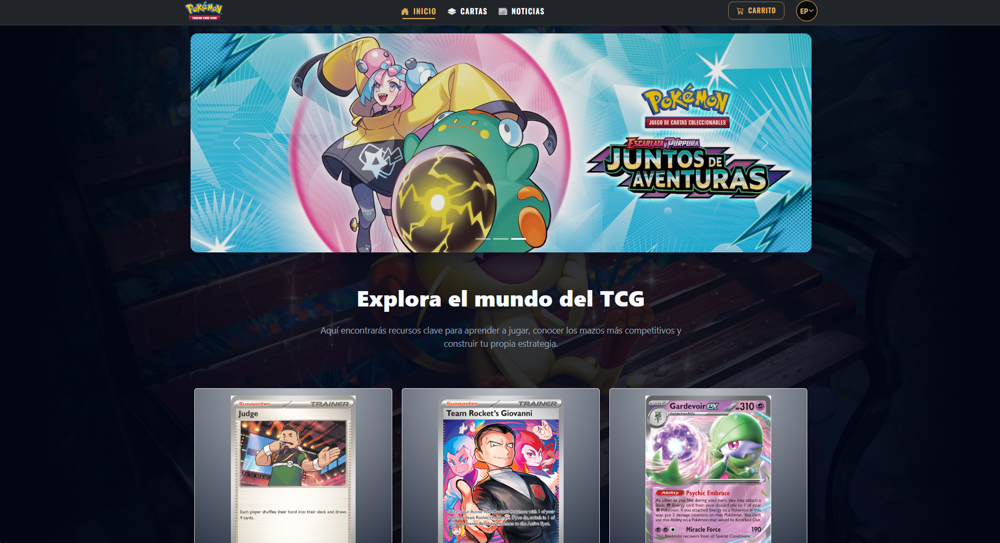
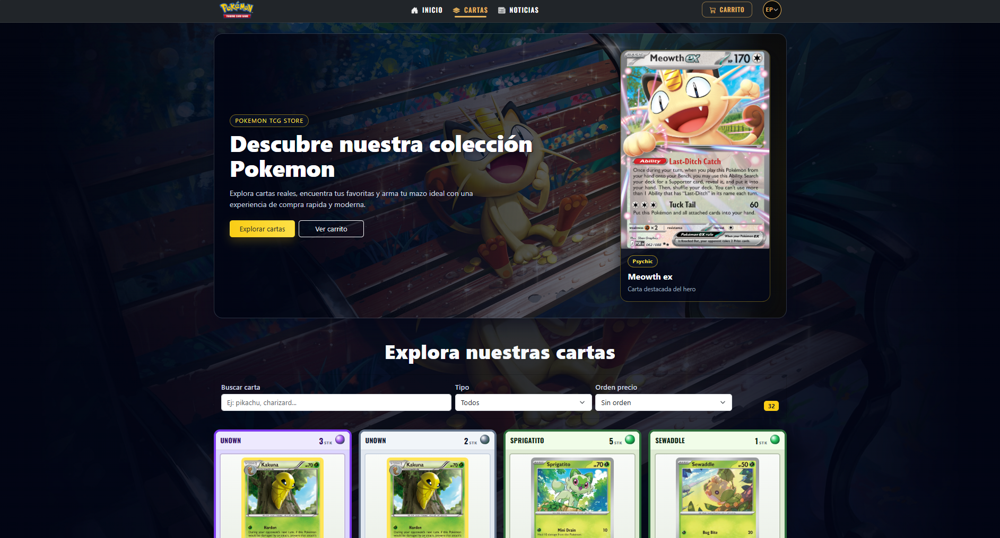
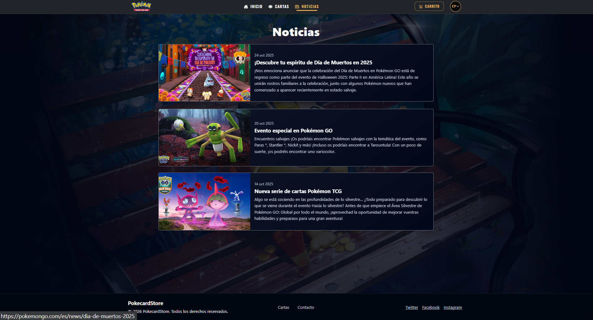

# 🃏 Ingenieria DevOps - Pokémon TCG Store

## 📌 Descripción

Proyecto frontend desarrollado en React para la visualización y gestión de cartas Pokémon TCG.

## 📸 Screenshots

### 🏠 Home

### 🃏 Cartas

### Noticias

Incluye funcionalidades como:

- Visualización de cartas Pokémon
- Carrito de compras con persistencia en localStorage
- Consumo de API externa (TCGdex)
- Interfaz moderna estilo tienda gaming

---

## ⚙️ Instalación

``bash
git clone https://github.com/Deimonlay13/Ingenieria-Devops.git
cd Ingenieria-Devops
npm install
npm run dev
🧠 Modelo de Branching

Se utilizó una estrategia basada en GitFlow simplificado:

main → rama estable (producción)
develop → integración de cambios
fix/* → correcciones o mejoras
chore/* → tareas técnicas (ej: CI)
🔁 Flujo de trabajo
Crear rama desde develop
Implementar cambios
Realizar commit
Subir cambios al repositorio
Crear Pull Request hacia develop
Revisar y hacer merge
Integración final hacia main
🏷️ Convención de commits

Se utilizó una convención basada en prefijos:

feat: nuevas funcionalidades
fix: correcciones
chore: tareas técnicas
docs: documentación

Ejemplos:

feat: agrega carrito local
fix: corrige render de cartas
chore: agrega workflow CI
⚡ GitHub Actions (CI)

Se implementó integración continua mediante:

.github/workflows/ci.yml
Se ejecuta en:
push a develop
pull request a main
Tareas realizadas:
instalación de dependencias
build del proyecto
🌐 API utilizada

Se utilizó la API pública:

https://api.tcgdex.net

Para obtener información real de cartas Pokémon TCG.

🧪 Manejo de backend caído

Se implementó un sistema de fallback con datos mock para asegurar el funcionamiento del proyecto en caso de fallos en la API.

🤖 Uso de Inteligencia Artificial

Se utilizó IA (ChatGPT / Cursor) como apoyo en:

diseño de interfaz
configuración de CI
integración de API
mejoras de código
🚀 Estado del proyecto

✔ Aplicación funcional
✔ UI mejorada
✔ Integración con API
✔ CI configurado
✔ Flujo de trabajo con Git implementado

👨‍💻 Autor

Diego Pizarro

